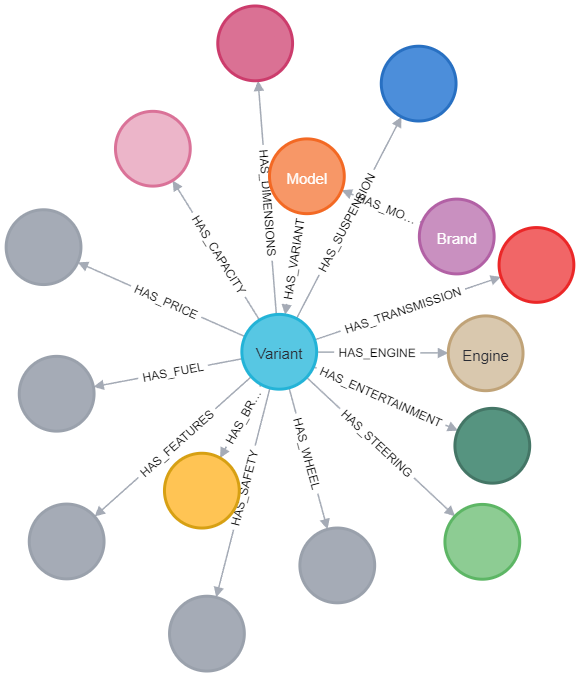
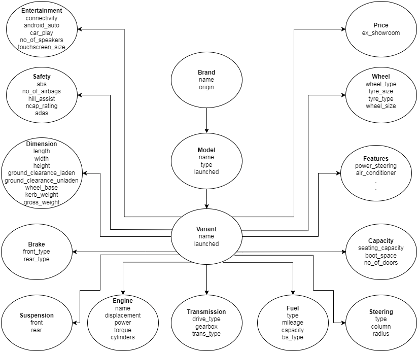
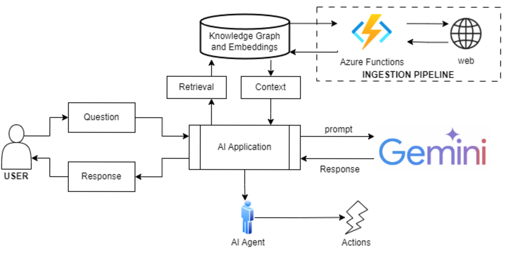
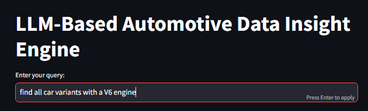
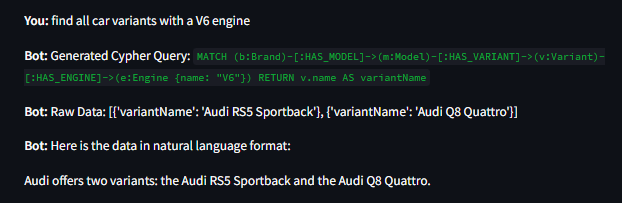
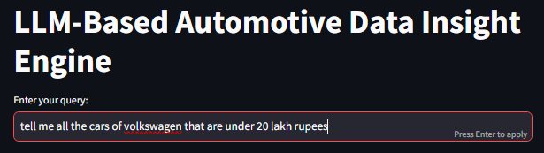
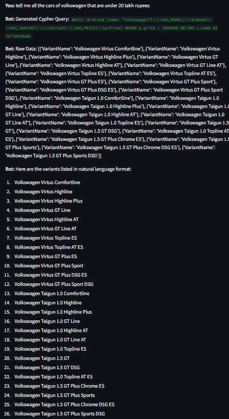

# VWisionaries: Smart Insights for Next-Gen Vehicle Comparisons

## Problem Statement
In today’s competitive automotive market, **designing a standout vehicle** is a challenge. Decisions often depend on scattered and incomplete information.

### Key Challenges:

- **Scattered Data:** Vehicle specifications and comparisons are spread across multiple platforms, making analysis time-consuming.

- **Subjectivity in Selection:** Customers and manufacturers struggle to identify the best options due to the lack of structured insights.

- **Need for Competitive Edge:** Manufacturers often miss opportunities to address feature gaps or differentiate effectively.

Without a reliable solution, decision-making can lead to **lost opportunities** and **sluggish** innovation.

## Our Solution

VWisionaries addresses these challenges with a **data-driven smart vehicle analysis tool** that simplifies comparison and decision-making.

**What We Offer:**

- **Centralized Data Platform:** Aggregates data from automotive websites like *CarDekho* and *CarWale* into a structured **Knowledge Graph**.

- **AI-Powered Insights:** Enables intuitive querying and accurate vehicle comparisons.

- **Interactive Experience:** Provides a user-friendly interface for manufacturers and customers to identify key differentiators.

## Key Features

**Knowledge Graph:**

We used **Neo4J** to create a graph-based database that connects:
- Vehicle specifications (brands, models, variants, features, pricing).

- Comparative insights based on structured relationships.

    
    

**Schema Design:** The Knowledge Graph is powered by a well-structured schema that defines relationships like:
    
    Brand → Models → Variants → Features

where, *'Features'* include **Engine, Fuel, Safety, Features, Capacity, Dimensions, Suspension, Brake, Steering, Wheel, Entertainment, Transmission** and their respective properties as shown in the below Schema Design Diagram.

    

## Implementation

### Tech Stack

- **Knowledge Graphs:** Neo4J for storage and querying vehicle relationships.

- **Data Ingestion:** Python, BeautifulSoup and Azure Functions to scrape and load data.

- **Frontend:** Streamlit for dynamic user interaction.

### Architecture Diagram

    

## Use Cases

### Customer Assistance

**Query:** “Suggest a petrol sedan under ₹14 Lakhs.”

**Response:**
- *"The Volkswagen Virtus Highline Plus is a perfect blend of power, style, and advanced features at ₹13.5 Lakhs."*

### Manufacturer Insights

- Compare VW models against competitors to identify feature gaps.

## Screenshots

    
    

    
    

## Target Users

- **End-Customers:** To find the ideal vehicle.

- **Automobile Manufacturers:** To address competitive gaps.

- **Product Managers:** To build customer-centric solutions.

- **Market Analysts and Consultants:** For industry insights.

- **Dealerships:** To optimize inventory and engagement.

## Future Scope

- Suggest improvements based on user reviews.

- Use sentiment analysis to guide future designs.

- Help schedule test drives and showroom visits through AI-agents.